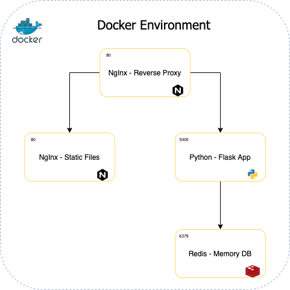

# DockerComposeExample
This repository provides a brief example on how to create a quick, easy to configure and a practical web application environment. The purpose of this exercise is to demonstrate the portability and the easy use of containers through the use of Docker. 

This environment is formed by 4 containers interacting with each other in the following way: 
1. An NgInx container acting as a reverse proxy. This container is in charge of redirecting traffic between the web app and the NgInx container hosting the static files. 
1. A python container running the Flask web application. 
1. A reds container serving as an in memory database 
1. A NgInx container serving static files. 



## Pre-Requisites 
1. You need to have Docker installed in your machine. 

## How to use
1. Clone the repository in the directory of your preference. 
1. Navigate to the project root folder. 
1. In a terminal, run: 
    ```bash
    docker-compose up -d. 
    ```
  This command will create all the docker images and containers necessary to run your environment. 
1. When all the containers are up and running, you can open your browser and hit http://localhost:5000 to reach the homepage of the Flask app, or hit http://localhost:8081/images/<image> to check some of the static content.
  
## How this example works: 
- When you hit http://localhost:5000, you’re actually reaching the first NgInx container that is acting as the reverse proxy server. This container then redirects your request to the python container running the flask application on port 5000. 
- Every time you hit the home page of the Flask app, it will increment a variable stored in a redis container that stores the number of times home page has been visited. The value of this variable will be visible in your browser, with the message “This page has been visited <N> times”. 
- Then, if you hit http://localhost:8081, the reverse proxy will redirect your request to the second NgInx container, which is serving static content in port 8081. Only the first NgInx container is exposed, while the other ones are private containers, not reachable from outside docker daemon. 
  
Feel free to modify the source code and to add whatever static content you want to the application. Also feel free to modify the docker-compose file to explore and learn other benefits of docker. 

Thanks for using this repo! 
